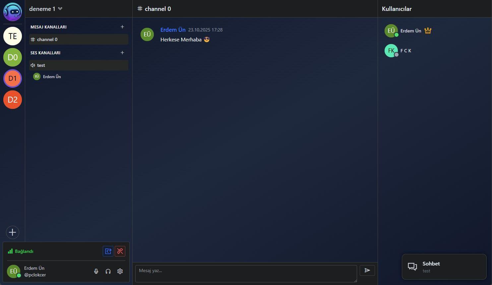
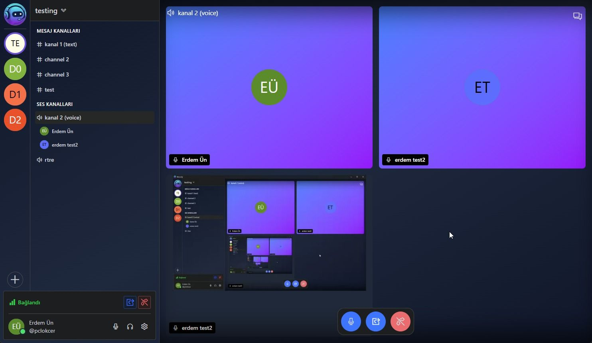

#  Wecordy

Chat with friends, create communities, and connect from anywhere. With Wecordy, communication has never been easier.

<table>
<tr>
<td width="50%">

</td>
<td width="50%">

</td>
</tr>
</table>

## ✨ Features

- 💬 **Text Channels**

  - Organized text communication
  - Real-time message updates
  - Channel categorization
  - User status indicators

- 🎤 **Voice Channels**

  - Crystal-clear voice communication
  - Multiple voice rooms
  - User presence visualization
  - Easy channel switching

- 🎯 **User Experience**

  - Clean, intuitive interface
  - Dark mode by default
  - User status indicators
  - Custom server organization
  - Easy navigation between channels

- 🛠 **Server Management**
  - Flexible channel creation
  - Category organization
  - Customizable server settings

## 🚀 Getting Started

To start using Wecordy:

1. Visit our website [wecordy.com](https://wecordy.com)
2. Create your account
3. Join existing servers or create your own
4. Start communicating with your community!

## 💻 Development

Wecordy is built with modern technologies to ensure the best possible performance and user experience.

## 🌟 Support

For support, email info@wecordy.com

---

  Made with ❤️ by the Wecordy Team

